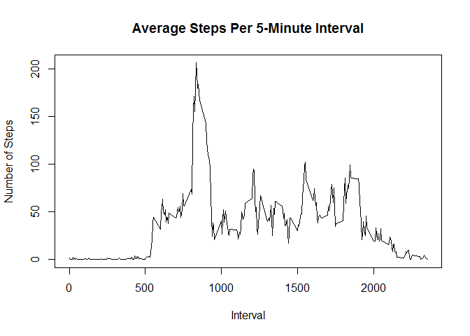

# Reproducible Research: Peer Assessment 1

##Init

#libraries
library(knitr)

all code  should be outputed. 

```r
# set global options
knitr::opts_chunk$set(echo=TRUE)

#for reproductibility
set.seed(2015)
```

## Loading and preprocessing the data

```r
# create data sub-directory data
dataDir <- file.path(".", "data")
if(!file.exists(dataDir)) { dir.create(dataDir) }

#unzip file
dataFile <- file.path(dataDir, "activity.csv")

if(!file.exists(dataFile)) { 
  unzip ("activity.zip", exdir=dataDir)
}
adata <- read.csv(dataFile)

names(adata)
```

```
## [1] "steps"    "date"     "interval"
```

```r
str(adata)
```

```
## 'data.frame':	17568 obs. of  3 variables:
##  $ steps   : int  NA NA NA NA NA NA NA NA NA NA ...
##  $ date    : Factor w/ 61 levels "2012-10-01","2012-10-02",..: 1 1 1 1 1 1 1 1 1 1 ...
##  $ interval: int  0 5 10 15 20 25 30 35 40 45 ...
```

```r
head(adata)
```

```
##   steps       date interval
## 1    NA 2012-10-01        0
## 2    NA 2012-10-01        5
## 3    NA 2012-10-01       10
## 4    NA 2012-10-01       15
## 5    NA 2012-10-01       20
## 6    NA 2012-10-01       25
```

## What is mean total number of steps taken per day?
The following histogram displays the total number of steps taken per day, ignoring missing values.


```r
histData <- aggregate(adata[1],by=adata[2],FUN=sum,na.rm=TRUE)
hist(histData$steps,
     breaks=20,
     col = "red",
     main = "Histogram of Total Number of Steps Taken per Day",
     xlab = "Steps per Day")
```

 

```r
mean(histData$steps)   # mean
```

```
## [1] 9354.23
```

```r
median(histData$steps) # median
```

```
## [1] 10395
```


## What is the average daily activity pattern?

1. Make a time series plot (i.e. type = "l") of the 5-minute interval (x-axis) and the average number of steps taken, averaged across all days (y-axis)


```r
# calculate the sample data aggregated by interval.
intervalData <- aggregate(adata[1],by=adata[3],FUN=mean,na.rm=TRUE)
plot(x=intervalData$interval,
     y=intervalData$steps,
     type="l",
     main="Average Steps Per 5-Minute Interval",
     xlab="Interval",
     ylab="Number of Steps")
```

 

2. Which 5-minute interval, on average across all the days in the dataset, contains the maximum number of steps?


```r
max_interval <- intervalData[intervalData$steps==max(intervalData$steps),]

max_interval[1] # maximum interval
```

```
##     interval
## 104      835
```

```r
round(max_interval[2],1) # maximum steps per interval
```

```
##     steps
## 104 206.2
```


## Imputing missing values

1. Calculate and report the total number of missing values in the dataset (i.e. the total number of rows with NAs)


```r
sum(is.na(adata$steps))
```

```
## [1] 2304
```


2. Devise a strategy for filling in all of the missing values in the dataset. The strategy does not need to be sophisticated. For example, you could use the mean/median for that day, or the mean for that 5-minute interval, etc.

3. Create a new dataset that is equal to the original dataset but with the missing data filled in.


```r
library(plyr)
# create a replace function to replace ny by mean
impute.mean <- function(x) replace(x, is.na(x), mean(x, na.rm = TRUE))
#use ddply to replace missing steps
adataNoMissing <- ddply(adata, ~interval, transform, steps = impute.mean(steps))
```


4. Make a histogram of the total number of steps taken each day and Calculate and report the mean and median total number of steps taken per day. 

```r
#  aggregate impute data by date
aggregatedByDate <- aggregate(adataNoMissing[1],by=adataNoMissing[2],FUN=sum,na.rm=TRUE)
# create histogram
hist(aggregatedByDate$steps,
     breaks=20,
     col = "red",
     main = "Histogram of Total Number of Steps Taken per Day (Imputed Data)",
     xlab = "Steps per Day")
```

 

```r
mean(aggregatedByDate$steps)   # mean
```

```
## [1] 10766.19
```

```r
median(aggregatedByDate$steps) # median
```

```
## [1] 10766.19
```

Do these values differ from the estimates from the first part of the assignment? 
The mean and median values  has increased both  from those calculated in the first part of the assignment.  

What is the impact of imputing missing data on the estimates of the total daily number of steps?
The total daily number of steps increases as a result of added values.


## Are there differences in activity patterns between weekdays and weekends?

1. Create a new factor variable in the dataset with two levels - "weekday" and "weekend" indicating whether a given date is a weekday or weekend day.

```r
adataNoMissing$dayname = weekdays(as.Date(adataNoMissing$date))
#add a column daytype and init it with  Weekday
adataNoMissing$daytype <-"Weekday"

#do not use day names because of diffrent system settings
adataNoMissing$daynumber = as.POSIXlt(adataNoMissing$date)$wday
adataNoMissing$daytype [adataNoMissing$daynumber %in% c(6, 7)] <- "Weekend"
# check the result
head(adataNoMissing)
```

```
##       steps       date interval    dayname daytype daynumber
## 1  1.716981 2012-10-01        0     Montag Weekday         1
## 2  0.000000 2012-10-02        0   Dienstag Weekday         2
## 3  0.000000 2012-10-03        0   Mittwoch Weekday         3
## 4 47.000000 2012-10-04        0 Donnerstag Weekday         4
## 5  0.000000 2012-10-05        0    Freitag Weekday         5
## 6  0.000000 2012-10-06        0    Samstag Weekend         6
```

2. Make a panel plot containing a time series plot (i.e. type = "l") of the 5-minute interval (x-axis) and the average number of steps taken, averaged across all weekday days or weekend days (y-axis). See the README file in the GitHub repository to see an example of what this plot should look like using simulated data.


```r
intervalData <- aggregate(adataNoMissing[1],
                                   by=adataNoMissing[c(3,5)],
                                   FUN=mean,
                                   na.rm=TRUE)
head(intervalData)
```

```
##   interval daytype      steps
## 1        0 Weekday 1.94375222
## 2        5 Weekday 0.38447846
## 3       10 Weekday 0.14951940
## 4       15 Weekday 0.17087932
## 5       20 Weekday 0.08543966
## 6       25 Weekday 2.37095052
```

```r
library(ggplot2)
plot <- ggplot(data = intervalData,
               aes(x=interval,y=steps))
plot + geom_line() + facet_wrap(~daytype,nrow=2)
```

 
